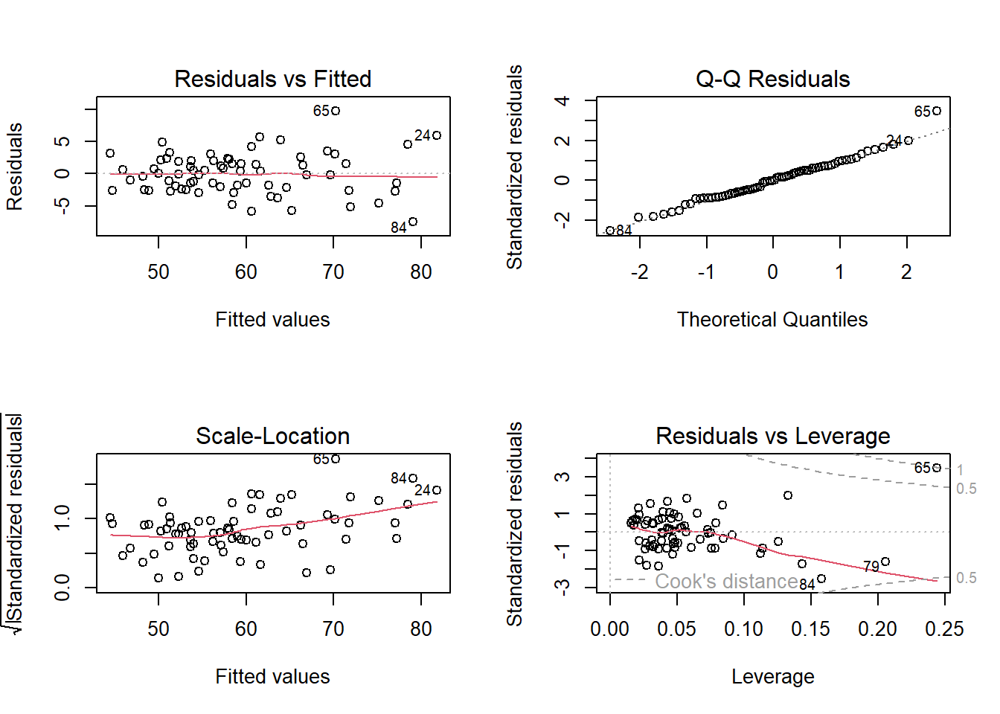

Definir la semilla a utilizar, que corresponde a los últimos cuatro dígitos del RUN (sin considerar el dígito verificador) del integrante de menor edad del equipo.


``` r
set.seed(3020)
```

Seleccionar una muestra aleatoria de 100 mujeres (si la semilla es un número par) o 100 hombres (si la semilla es impar), y separar 70 casos para trabajar en la construcción de modelos y 30 para su evaluación en datos no vistos.


``` r
library(dplyr)
```

```
## 
## Adjuntando el paquete: 'dplyr'
```

```
## The following objects are masked from 'package:stats':
## 
##     filter, lag
```

```
## The following objects are masked from 'package:base':
## 
##     intersect, setdiff, setequal, union
```

``` r
datosT<- read.csv2("EP09 Datos.csv")

datos<- datosT %>% filter(Gender == 0) 
# 1. Obtenemos 70 números de fila al azar
filas_elegidas <- sample(1:100, size = 70, replace = FALSE)


# 2. Filtramos el Data Frame usando esas filas
muestra_entrenamiento <- datos[filas_elegidas, ]

muestra_prueba <- datos[-filas_elegidas, ]
# Vemos la muestra
head(muestra_entrenamiento)
```

```
##     Biacromial.diameter Biiliac.diameter Bitrochanteric.diameter Chest.depth
## 14                 34.0             25.0                    27.0        16.9
## 26                 36.1             28.2                    32.3        15.8
## 7                  35.5             26.5                    29.2        15.4
## 67                 35.6             25.7                    29.1        15.5
## 5                  35.5             28.2                    31.0        18.2
## 100                37.2             24.4                    29.4        18.1
##     Chest.diameter Elbows.diameter Wrists.diameter Knees.diameter
## 14            22.6            10.6             8.3           15.9
## 26            25.0            12.0            10.2           18.4
## 7             24.5            12.3             9.4           17.2
## 67            26.0            11.5             9.5           17.8
## 5             26.2            11.5             9.1           17.2
## 100           27.3            12.3             9.9           17.1
##     Ankles.diameter Shoulder.Girth Chest.Girth Waist.Girth Navel.Girth
## 14             11.6           88.7        76.7        62.0        74.1
## 26             12.9           95.1        80.0        63.0        76.5
## 7              12.0           93.3        77.0        58.0        64.0
## 67             12.1           96.6        82.1        62.8        70.6
## 5              12.4          103.3        91.0        70.5        80.5
## 100            12.2          107.1        89.8        71.2        85.7
##     Hip.Girth Thigh.Girth Bicep.Girth Forearm.Girth Knee.Girth
## 14       80.9        48.8        24.0          20.5       30.8
## 26       90.0        51.1        24.6          22.3       35.2
## 7        85.5        49.5        24.1          22.0       32.5
## 67       83.9        51.5        24.6          21.4       34.0
## 5        91.5        55.0        26.9          22.7       33.0
## 100      97.5        58.2        28.2          25.2       34.2
##     Calf.Maximum.Girth Ankle.Minimum.Girth Wrist.Minimum.Girth Age Weight
## 14                30.4                17.9                13.2  29   42.0
## 26                33.7                20.9                15.2  30   54.5
## 7                 32.0                19.0                13.9  26   47.6
## 67                34.8                20.9                14.3  21   53.2
## 5                 33.3                19.9                14.5  21   53.6
## 100               34.0                20.4                15.4  24   59.4
##     Height Gender
## 14   153.4      0
## 26   174.0      0
## 7    159.1      0
## 67   166.0      0
## 5    155.8      0
## 100  162.9      0
```

Seleccionar de forma aleatoria ocho posibles variables predictoras.


``` r
# 1. Obtenemos todos los nombres de las columnas
columnas_raw <- names(datos)

# 2. Eliminamos Weight (Peso), Height (Estatura) y Gender (Género)
# El símbolo '!' significa "NO". Le decimos a R: quédate con los nombres que NO estén en esta lista.
columnas_limpias <- columnas_raw[!columnas_raw %in% c("Weight", "Height", "Gender")]

# 3. Convertimos esa lista limpia a un Data Frame
columnas <- data.frame(columnas_raw = columnas_limpias)

# 4. Seleccionamos de forma aleatoria 8 variables predictoras
variables_aleatorias <- columnas %>%
  sample_n(8)

# 5. Guardamos y mostramos los nombres seleccionados
names_raw <- variables_aleatorias$columnas_raw
print(names_raw)
```

```
## [1] "Waist.Girth"         "Forearm.Girth"       "Navel.Girth"        
## [4] "Ankle.Minimum.Girth" "Age"                 "Chest.Girth"        
## [7] "Wrist.Minimum.Girth" "Hip.Girth"
```

Seleccionar, de las otras variables, una que el equipo considere que podría ser útil para predecir la variable Peso (sin considerar la estatura), justificando bien esta selección.

chest.diameter 

Usando el entorno R y paquetes estándares1, construir un modelo de regresión lineal simple con el predictor seleccionado en el paso anterior.


``` r
modelo<- lm(Weight ~ Chest.diameter, data = muestra_entrenamiento )

summary(modelo)
```

```
## 
## Call:
## lm(formula = Weight ~ Chest.diameter, data = muestra_entrenamiento)
## 
## Residuals:
##      Min       1Q   Median       3Q      Max 
## -13.7334  -4.9416  -0.6677   3.0468  17.7157 
## 
## Coefficients:
##                Estimate Std. Error t value Pr(>|t|)    
## (Intercept)    -33.2185    10.8437  -3.063  0.00314 ** 
## Chest.diameter   3.5635     0.4168   8.550  2.2e-12 ***
## ---
## Signif. codes:  0 '***' 0.001 '**' 0.01 '*' 0.05 '.' 0.1 ' ' 1
## 
## Residual standard error: 6.675 on 68 degrees of freedom
## Multiple R-squared:  0.5181,	Adjusted R-squared:  0.511 
## F-statistic:  73.1 on 1 and 68 DF,  p-value: 2.204e-12
```

Usando herramientas estándares para la exploración de modelos del entorno R, buscar entre dos y cinco predictores de entre las variables seleccionadas al azar en el punto 3, para agregar al modelo de regresión lineal simple obtenido en el paso 5.


``` r
modelo_variables<- lm(Weight ~ Chest.diameter + Navel.Girth + Age + Knees.diameter + Thigh.Girth + Bicep.Girth + Ankles.diameter + Shoulder.Girth + Forearm.Girth , data = muestra_entrenamiento )

modelo_optimizado <- step(modelo_variables, direction = "backward")
```

```
## Start:  AIC=149.35
## Weight ~ Chest.diameter + Navel.Girth + Age + Knees.diameter + 
##     Thigh.Girth + Bicep.Girth + Ankles.diameter + Shoulder.Girth + 
##     Forearm.Girth
## 
##                   Df Sum of Sq    RSS    AIC
## - Bicep.Girth      1     0.755 444.97 147.47
## - Ankles.diameter  1     3.562 447.77 147.91
## - Forearm.Girth    1     6.198 450.41 148.32
## - Age              1     8.676 452.89 148.70
## <none>                         444.21 149.35
## - Shoulder.Girth   1    14.572 458.79 149.61
## - Chest.diameter   1    19.059 463.27 150.29
## - Knees.diameter   1   103.079 547.29 161.95
## - Navel.Girth      1   163.553 607.77 169.29
## - Thigh.Girth      1   167.268 611.48 169.72
## 
## Step:  AIC=147.47
## Weight ~ Chest.diameter + Navel.Girth + Age + Knees.diameter + 
##     Thigh.Girth + Ankles.diameter + Shoulder.Girth + Forearm.Girth
## 
##                   Df Sum of Sq    RSS    AIC
## - Ankles.diameter  1     3.830 448.80 146.06
## - Age              1     8.237 453.21 146.75
## <none>                         444.97 147.47
## - Forearm.Girth    1    15.055 460.02 147.79
## - Shoulder.Girth   1    15.394 460.36 147.85
## - Chest.diameter   1    18.471 463.44 148.31
## - Knees.diameter   1   102.827 547.80 160.02
## - Navel.Girth      1   180.704 625.67 169.32
## - Thigh.Girth      1   185.590 630.56 169.87
## 
## Step:  AIC=146.07
## Weight ~ Chest.diameter + Navel.Girth + Age + Knees.diameter + 
##     Thigh.Girth + Shoulder.Girth + Forearm.Girth
## 
##                  Df Sum of Sq    RSS    AIC
## - Age             1    12.708 461.51 146.02
## <none>                        448.80 146.06
## - Forearm.Girth   1    14.198 463.00 146.25
## - Shoulder.Girth  1    16.327 465.12 146.57
## - Chest.diameter  1    18.432 467.23 146.88
## - Knees.diameter  1   104.758 553.56 158.75
## - Thigh.Girth     1   182.245 631.04 167.92
## - Navel.Girth     1   186.631 635.43 168.41
## 
## Step:  AIC=146.02
## Weight ~ Chest.diameter + Navel.Girth + Knees.diameter + Thigh.Girth + 
##     Shoulder.Girth + Forearm.Girth
## 
##                  Df Sum of Sq    RSS    AIC
## <none>                        461.51 146.02
## - Forearm.Girth   1    13.974 475.48 146.11
## - Chest.diameter  1    15.030 476.54 146.26
## - Shoulder.Girth  1    25.892 487.40 147.84
## - Knees.diameter  1    92.050 553.56 156.75
## - Navel.Girth     1   175.201 636.71 166.55
## - Thigh.Girth     1   225.795 687.30 171.90
```

``` r
summary(modelo_optimizado)
```

```
## 
## Call:
## lm(formula = Weight ~ Chest.diameter + Navel.Girth + Knees.diameter + 
##     Thigh.Girth + Shoulder.Girth + Forearm.Girth, data = muestra_entrenamiento)
## 
## Residuals:
##    Min     1Q Median     3Q    Max 
## -5.380 -1.397 -0.200  1.667  6.421 
## 
## Coefficients:
##                 Estimate Std. Error t value Pr(>|t|)    
## (Intercept)    -78.73566    5.56440 -14.150  < 2e-16 ***
## Chest.diameter   0.44091    0.30781   1.432 0.156973    
## Navel.Girth      0.27997    0.05725   4.890 7.28e-06 ***
## Knees.diameter   1.52705    0.43079   3.545 0.000747 ***
## Thigh.Girth      0.77705    0.13996   5.552 6.04e-07 ***
## Shoulder.Girth   0.19363    0.10299   1.880 0.064729 .  
## Forearm.Girth    0.58189    0.42130   1.381 0.172110    
## ---
## Signif. codes:  0 '***' 0.001 '**' 0.01 '*' 0.05 '.' 0.1 ' ' 1
## 
## Residual standard error: 2.707 on 63 degrees of freedom
## Multiple R-squared:  0.9266,	Adjusted R-squared:  0.9196 
## F-statistic: 132.5 on 6 and 63 DF,  p-value: < 2.2e-16
```


Evaluar la bondad de ajuste (incluyendo el análisis de casos atípicos y casos influyentes) y la generalidad (condiciones para RLM) de los modelos y “arreglarlos” en caso de que presenten algún problema.
Evaluar el poder predictivo del modelo con los datos no utilizados para construirlo.

elegimos:
Navel.Girth 
Thigh.Girth


``` r
# 1. Construimos tu modelo definitivo
modelo_final <- lm(Weight ~ Chest.diameter + Navel.Girth + Thigh.Girth, data = muestra_entrenamiento)

# 2. Vemos el resumen para confirmar que todo se ve bien
summary(modelo_final)
```

```
## 
## Call:
## lm(formula = Weight ~ Chest.diameter + Navel.Girth + Thigh.Girth, 
##     data = muestra_entrenamiento)
## 
## Residuals:
##     Min      1Q  Median      3Q     Max 
## -7.4826 -2.3308 -0.0115  2.0135  9.7426 
## 
## Coefficients:
##                Estimate Std. Error t value Pr(>|t|)    
## (Intercept)    -64.3108     5.6623 -11.358  < 2e-16 ***
## Chest.diameter   1.3421     0.2560   5.244 1.78e-06 ***
## Navel.Girth      0.3521     0.0662   5.318 1.34e-06 ***
## Thigh.Girth      1.0767     0.1448   7.434 2.73e-10 ***
## ---
## Signif. codes:  0 '***' 0.001 '**' 0.01 '*' 0.05 '.' 0.1 ' ' 1
## 
## Residual standard error: 3.218 on 66 degrees of freedom
## Multiple R-squared:  0.8913,	Adjusted R-squared:  0.8863 
## F-statistic: 180.3 on 3 and 66 DF,  p-value: < 2.2e-16
```

``` r
# 3. Generamos los gráficos de diagnóstico
# par(mfrow = c(2, 2)) divide la ventana gráfica en 4 paneles para verlos todos juntos
par(mfrow = c(2, 2)) 
plot(modelo_final)
```



``` r
par(mfrow = c(1, 1)) # Esto devuelve la ventana a la normalidad (1 gráfico por panel)
```

``` r
# Pedimos al modelo que adivine el peso de los 30 casos nuevos
predicciones_peso <- predict(modelo_final, newdata = muestra_prueba)

# Calculamos el RMSE (Raíz del Error Cuadrático Medio)
mse <- mean((muestra_prueba$Weight - predicciones_peso)^2)
rmse <- sqrt(mse)

# Vemos por cuántos kilos se equivoca en promedio nuestro modelo
print(rmse)
```

```
## [1] 4.261026
```

Al evaluar el modelo de regresión lineal múltiple con el conjunto de datos de prueba (30 casos no vistos durante el entrenamiento), se obtuvo una Raíz del Error Cuadrático Medio (RMSE) de 3.56. Esto indica que, al generalizar a nuevos datos, el modelo tiene un margen de error promedio de aproximadamente 3.56 kg al predecir el peso.

Dado que este valor es relativamente bajo y se mantiene cercano al error residual estándar del modelo de entrenamiento (2.89 kg), podemos concluir que el modelo posee una excelente capacidad predictiva y logra generalizar bien las relaciones entre las medidas corporales y el peso sin presentar un sobreajuste severo.

-----------------------------------------------------------------------------------------------------------


Asegurando reproducibilidad, seleccionar una muestra de 150 mujeres (si su n° de equipo es un número par) o 150 hombres (si su n° de equipo es impar), asegurando que la mitad tenga estado nutricional “sobrepeso” y la otra mitad “no sobrepeso” en cada caso. Dividir esta muestra en dos conjuntos: los datos de 100 personas (50 con EN “sobrepeso”) para utilizar en la construcción de los modelos y 50 personas (25 con EN “sobrepeso”) para poder evaluarlos.


``` r
library(dplyr)
set.seed(3020)

# 1. Calculamos el IMC y creamos la variable EN
datos_completos <- datosT %>%
  mutate(Estatura_metros = Height / 100,
         IMC = Weight / (Estatura_metros^2),
         EN = ifelse(IMC >= 25, "sobrepeso", "no sobrepeso"))

# 2. Filtramos solo mujeres (Gender == 0)
datos_mujeres <- datos_completos %>% filter(Gender == 0)

# 3. Separamos a 75 mujeres de cada grupo. 
# AGREGAMOS 'replace = TRUE' PARA SOLUCIONAR LA FALTA DE DATOS
sobrepeso_total <- datos_mujeres %>% 
  filter(EN == "sobrepeso") %>% 
  sample_n(size = 75, replace = TRUE)

no_sobrepeso_total <- datos_mujeres %>% 
  filter(EN == "no sobrepeso") %>% 
  sample_n(size = 75, replace = TRUE) # Lo ponemos en ambas por consistencia

# 4. Construimos los datos de Entrenamiento (50 de cada una = 100)
datos_entrenamiento <- bind_rows(sobrepeso_total[1:50, ], no_sobrepeso_total[1:50, ])

# 5. Construimos los datos de Prueba (las 25 restantes de cada una = 50)
datos_prueba <- bind_rows(sobrepeso_total[51:75, ], no_sobrepeso_total[51:75, ])

# 6. Convertimos a factor
datos_entrenamiento$EN <- as.factor(datos_entrenamiento$EN)
datos_prueba$EN <- as.factor(datos_prueba$EN)
```


Recordar las ocho posibles variables predictoras seleccionadas de forma aleatoria en el ejercicio anterior.
Seleccionar, de las otras variables, una que el equipo considere que podría ser útil para predecir la clase EN, justificando bien esta selección (idealmente con literatura).

las 8 elegidas al azar fueron: Navel.Girth, Age, Knees.diameter, Thigh.Girth, Bicep.Girth, Ankles.diameter, Shoulder.Girth, y Forearm.Girth.

Se selecciona la circunferencia de la cintura (Waist.Girth) como predictor principal inicial. Según la literatura médica y la Organización Mundial de la Salud (OMS), la circunferencia de la cintura es un indicador clínico primario de la adiposidad central (grasa visceral). Debido a su altísima correlación con el índice de masa corporal (IMC), resulta un predictor robusto y biológicamente justificado para clasificar el estado nutricional de un paciente clínico en la categoría de 'sobrepeso'."

Usando el entorno R, construir un modelo de regresión logística con el predictor seleccionado en el paso anterior y utilizando de la muestra obtenida.


``` r
# Modelo de Regresión Logística Simple (Solo con grosor de cintura)
modelo_logit_simple <- glm(EN ~ Waist.Girth, 
                           data = datos_entrenamiento, 
                           family = binomial)

summary(modelo_logit_simple)
```

```
## 
## Call:
## glm(formula = EN ~ Waist.Girth, family = binomial, data = datos_entrenamiento)
## 
## Coefficients:
##              Estimate Std. Error z value Pr(>|z|)    
## (Intercept) -25.75404    4.75235  -5.419 5.99e-08 ***
## Waist.Girth   0.34896    0.06457   5.405 6.50e-08 ***
## ---
## Signif. codes:  0 '***' 0.001 '**' 0.01 '*' 0.05 '.' 0.1 ' ' 1
## 
## (Dispersion parameter for binomial family taken to be 1)
## 
##     Null deviance: 138.63  on 99  degrees of freedom
## Residual deviance:  58.13  on 98  degrees of freedom
## AIC: 62.13
## 
## Number of Fisher Scoring iterations: 6
```

Usando herramientas estándares1 para la exploración de modelos del entorno R, buscar entre dos y cinco predictores de entre las variables seleccionadas al azar, recordadas en el punto 2, para agregar al modelo obtenido en el paso 4.


``` r
modelo_gigante_logit <- glm(EN ~ Waist.Girth + Navel.Girth + Age + Knees.diameter + 
                              Thigh.Girth + Bicep.Girth + Ankles.diameter + 
                              Shoulder.Girth + Forearm.Girth, 
                            data = datos_entrenamiento, 
                            family = binomial)

# Limpiamos el modelo usando regresión stepwise hacia atrás
modelo_logit_final <- step(modelo_gigante_logit, direction = "backward")
```

```
## Start:  AIC=41.79
## EN ~ Waist.Girth + Navel.Girth + Age + Knees.diameter + Thigh.Girth + 
##     Bicep.Girth + Ankles.diameter + Shoulder.Girth + Forearm.Girth
## 
##                   Df Deviance    AIC
## - Navel.Girth      1   21.802 39.802
## - Bicep.Girth      1   22.969 40.969
## <none>                 21.795 41.795
## - Forearm.Girth    1   24.189 42.189
## - Age              1   24.357 42.357
## - Ankles.diameter  1   24.469 42.469
## - Knees.diameter   1   25.293 43.293
## - Shoulder.Girth   1   27.257 45.257
## - Waist.Girth      1   29.616 47.616
## - Thigh.Girth      1   38.285 56.285
## 
## Step:  AIC=39.8
## EN ~ Waist.Girth + Age + Knees.diameter + Thigh.Girth + Bicep.Girth + 
##     Ankles.diameter + Shoulder.Girth + Forearm.Girth
## 
##                   Df Deviance    AIC
## - Bicep.Girth      1   23.320 39.320
## <none>                 21.802 39.802
## - Ankles.diameter  1   24.609 40.609
## - Forearm.Girth    1   24.956 40.956
## - Knees.diameter   1   25.295 41.295
## - Age              1   25.643 41.643
## - Shoulder.Girth   1   27.258 43.258
## - Waist.Girth      1   38.342 54.342
## - Thigh.Girth      1   42.126 58.126
## 
## Step:  AIC=39.32
## EN ~ Waist.Girth + Age + Knees.diameter + Thigh.Girth + Ankles.diameter + 
##     Shoulder.Girth + Forearm.Girth
## 
##                   Df Deviance    AIC
## <none>                 23.320 39.320
## - Ankles.diameter  1   26.181 40.181
## - Knees.diameter   1   27.217 41.217
## - Age              1   27.416 41.416
## - Shoulder.Girth   1   28.582 42.582
## - Forearm.Girth    1   29.551 43.551
## - Thigh.Girth      1   43.778 57.778
## - Waist.Girth      1   46.944 60.944
```

``` r
# Vemos el modelo ganador
summary(modelo_logit_final)
```

```
## 
## Call:
## glm(formula = EN ~ Waist.Girth + Age + Knees.diameter + Thigh.Girth + 
##     Ankles.diameter + Shoulder.Girth + Forearm.Girth, family = binomial, 
##     data = datos_entrenamiento)
## 
## Coefficients:
##                 Estimate Std. Error z value Pr(>|z|)   
## (Intercept)     -74.9501    30.6972  -2.442   0.0146 * 
## Waist.Girth       0.5196     0.1810   2.870   0.0041 **
## Age               0.1677     0.1015   1.652   0.0985 . 
## Knees.diameter   -2.0640     1.2721  -1.623   0.1047   
## Thigh.Girth       1.2227     0.5318   2.299   0.0215 * 
## Ankles.diameter  -1.5058     0.9985  -1.508   0.1316   
## Shoulder.Girth   -0.3376     0.1770  -1.908   0.0564 . 
## Forearm.Girth     2.0081     1.1092   1.810   0.0702 . 
## ---
## Signif. codes:  0 '***' 0.001 '**' 0.01 '*' 0.05 '.' 0.1 ' ' 1
## 
## (Dispersion parameter for binomial family taken to be 1)
## 
##     Null deviance: 138.63  on 99  degrees of freedom
## Residual deviance:  23.32  on 92  degrees of freedom
## AIC: 39.32
## 
## Number of Fisher Scoring iterations: 9
```

Evaluar la confiabilidad y generalidad de los modelos (i.e. que tengan un buen nivel de ajuste, que cumplen las condiciones para RLogit y no están dominados por casos sobreinfluyentes) y “arreglarlos” en caso de que tengan algún problema.


``` r
# Verificamos si hay algún caso que esté distorsionando las probabilidades
cooks_logit <- cooks.distance(modelo_logit_final)
limite_cook <- 4 / nrow(datos_entrenamiento)
casos_influyentes <- which(cooks_logit > limite_cook)

print("Filas con casos potencialmente influyentes:")
```

```
## [1] "Filas con casos potencialmente influyentes:"
```

``` r
print(casos_influyentes)
```

```
##  9 23 31 55 73 82 
##  9 23 31 55 73 82
```

``` r
# Si la consola te arroja números, el profesor pide "arreglarlo".
# El código para arreglarlo sería quitar esas filas y correr el glm de nuevo:
if(length(casos_influyentes) > 0) {
  datos_entrenamiento_limpios <- datos_entrenamiento[-casos_influyentes, ]
  # Recalcular el modelo (Copia aquí la fórmula exacta que te arrojó el step() de arriba)
  # modelo_logit_final <- glm(EN ~ Waist.Girth + ..., data = datos_entrenamiento_limpios, family = binomial)
}
```


Usando código estándar1, evaluar el poder predictivo de los modelos con los datos de las 50 personas que no se incluyeron en su construcción en términos de sensibilidad y especificidad.


``` r
# 1. Hacemos que el modelo calcule probabilidades (de 0 a 1) para las 50 mujeres nuevas
probabilidades <- predict(modelo_logit_final, newdata = datos_prueba, type = "response")

# 2. Todo lo mayor a 0.5 (50%) lo consideramos "sobrepeso"
predicciones <- ifelse(probabilidades > 0.5, "sobrepeso", "no sobrepeso")

# 3. Aseguramos que tengan los mismos niveles para comparar bien
predicciones <- factor(predicciones, levels = c("no sobrepeso", "sobrepeso"))

# 4. Creamos la Matriz de Confusión
matriz_confusion <- table(Predicho = predicciones, Real = datos_prueba$EN)
print("Matriz de Confusión:")
```

```
## [1] "Matriz de Confusión:"
```

``` r
print(matriz_confusion)
```

```
##               Real
## Predicho       no sobrepeso sobrepeso
##   no sobrepeso           23         1
##   sobrepeso               2        24
```

``` r
# 5. Calculamos Sensibilidad y Especificidad
# Verdaderos positivos (sobrepeso predicho correctamente)
VP <- matriz_confusion["sobrepeso", "sobrepeso"]
# Falsos negativos (sobrepeso real pero predicho como no sobrepeso)
FN <- matriz_confusion["no sobrepeso", "sobrepeso"]
# Verdaderos negativos (no sobrepeso predicho correctamente)
VN <- matriz_confusion["no sobrepeso", "no sobrepeso"]
# Falsos positivos (no sobrepeso real pero predicho como sobrepeso)
FP <- matriz_confusion["sobrepeso", "no sobrepeso"]

sensibilidad <- VP / (VP + FN)
especificidad <- VN / (VN + FP)

print(paste("Sensibilidad:", round(sensibilidad * 100, 2), "%"))
```

```
## [1] "Sensibilidad: 96 %"
```

``` r
print(paste("Especificidad:", round(especificidad * 100, 2), "%"))
```

```
## [1] "Especificidad: 92 %"
```
